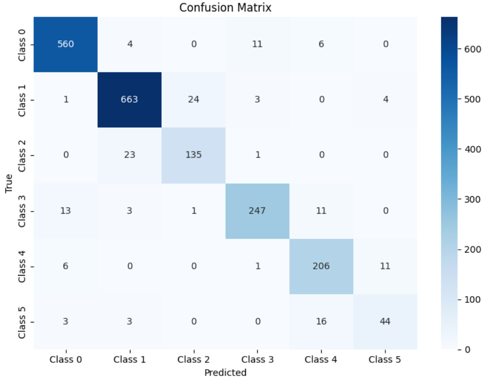
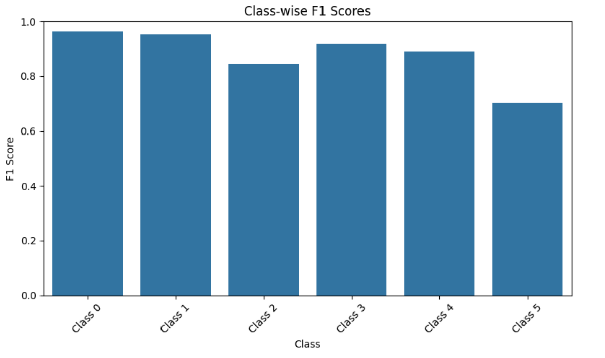
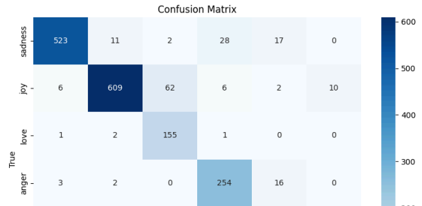
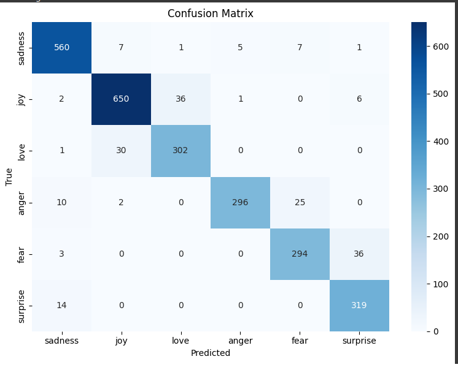
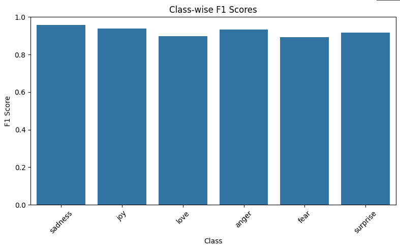

# BERT Text Classification with MLflow Tracking

This project implements a complete pipeline for training a BERT-based model to classify text into six classes. It includes automated preprocessing, and handling class imbalance via over-sampling, and experiment tracking with MLflow.

## Features

- **BERT-based text classification** into 6 distinct classes.
- **Preprocessing pipeline** for text cleaning and preparation.
- **Data imbalance handling** with automated over-sampling of minority classes.
- **MLflow integration** for tracking experiments, logging metrics, and model artifacts.


## Setup Instructions

### 1. Clone the Repository

```bash
git clone git@github.com:Paikarthik/interview.git
cd code
```

### 2. Create a Virtual Environment

```bash
python -m venv venv
source venv/bin/activate   # On Windows: venv\Scripts\activate
```

### 3. Install Dependencies

```bash
pip install -e .
```

### 4. Run the Training Pipeline
```bash
python pipeline/training_pipeline.py
```
This will:
- Preprocess the dataset
- Automatically detect and address class imbalance
- Fine-tune model for classification
- Log parameters, metrics, and artifacts to MLflow


## Approach

An initial **exploratory data analysis (EDA)** was conducted to understand the dataset's characteristics and guide modeling decisions.

- The **maximum number of words** in the dataset was found to be 66. Based on tokenization behavior (approximately 75 words ≈ 100 tokens), a **sequence length of 128 tokens** was chosen to ensure adequate context coverage without excessive padding or truncation.
  
- The dataset exhibited **significant class imbalance**, which negatively impacted model performance, particularly on underrepresented classes.

To address this imbalance and improve classification performance across all categories, several strategies were explored:

- **Class-weighted cross-entropy loss** was implemented to give higher importance to minority classes during training.
- **Focal loss** was experimented with to further mitigate the effect of class imbalance by focusing the model on harder-to-classify examples.
- **Resampling techniques** were applied, including:
  - **Over-sampling** minority classes to ensure sufficient representation during training.
  - **Under-sampling** majority classes to reduce their dominance and help balance the dataset.

## Experiment Results 

### Training model with the pre-processed data without over or under-sampling

**Confusion matrix:**



**Precision-Recall-F1 table:**

| Class   | Precision | Recall | F1-Score | Support |
|---------|-----------|--------|----------|---------|
| Class 0 | 0.9605    | 0.9639 | 0.9622   | 581     |
| Class 1 | 0.9526    | 0.9540 | 0.9533   | 695     |
| Class 2 | 0.8438    | 0.8491 | 0.8464   | 159     |
| Class 3 | 0.9392    | 0.8982 | 0.9182   | 275     |
| Class 4 | 0.8619    | 0.9196 | 0.8898   | 224     |
| Class 5 | 0.7458    | 0.6667 | 0.7040   | 66      |

**F1 graph:**



### Focal Loss

**Confusion matrix:**



**Precision-Recall-F1 table:**

| Class   | Precision | Recall  | F1-Score | Support |
|---------|-----------|---------|----------|---------|
| Class 0 | 0.9794    | 0.9002  | 0.9381   | 581     |
| Class 1 | 0.9744    | 0.8763  | 0.9227   | 695     |
| Class 2 | 0.7078    | 0.9748  | 0.8201   | 159     |
| Class 3 | 0.8759    | 0.9236  | 0.8991   | 275     |
| Class 4 | 0.8432    | 0.8884  | 0.8652   | 224     |
| Class 5 | 0.6354    | 0.9242  | 0.7531   | 66      |

## Model trained on balanced data 

**Confusion matrix:**



**Precision-Recall-F1 table:**

| Class   | Precision | Recall  | F1-Score | Support |
|---------|-----------|---------|----------|---------|
| Class 0 | 0.9492    | 0.9639  | 0.9564   | 581     |
| Class 1 | 0.9434    | 0.9353  | 0.9393   | 695     |
| Class 2 | 0.8909    | 0.9069  | 0.8988   | 333     |
| Class 3 | 0.9801    | 0.8889  | 0.9323   | 333     |
| Class 4 | 0.9018    | 0.8829  | 0.8923   | 333     |
| Class 5 | 0.8812    | 0.9580  | 0.9180   | 333     |

**F1 graph:**



## Improvement Strategies

- **Increase training iterations** to enhance model performance.
- **Implement hierarchical classification** to manage overlapping class labels more effectively.
- **Utilize larger models** for improved contextual understanding and richer feature representations.

## Deployment and Production

- **Use DistilBERT or other lightweight models** to reduce computational overhead.
- **Apply lower precision (e.g., FP16) or model quantization** to enable faster and more cost-efficient inference.
